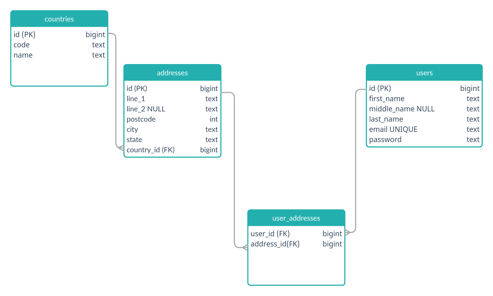

#  Introduction

Examples of using various popular database libraries and ORM in Go.

 - [sqlx](https://jmoiron.github.io/sqlx/)
 - [sqlc](https://docs.sqlc.dev)
 - [squirrel](https://github.com/Masterminds/squirrel)
 - [Gorm](https://github.com/go-gorm/gorm)
 - [sqlboiler](https://github.com/volatiletech/sqlboiler)
 - [ent](https://entgo.io/docs/getting-started)

The aim is to demonstrate and compare usage for several operations

 1. Simple CRUD operation
 2. 1-to-Many queries
 3. Many-to-many queries
 4. Dynamic list filter from query parameter 
 5. Transaction
 6. SQL Injection 

# Schema

There are four tables. The `users` table and `addresses` table are linked by the pivot `user_addresses` table. The `addresses` table contains a foreign key to `countries` to demonstrate 1-to-many relationship.

To make things interesting, we make `middle_name` an optional field. We also have a 'protected/hidden' field in which we do not want to return in a JSON response, like a password.

# Usage

## Setup

Setup postgres database by either running from docker-compose or manually.

    docker-compose up 

This creates both `postgres` database (which this repo uses) and `ent` database which is used by ent ORM.

If you create the database manually, execute the `database/01-postgres-schema.sql` script.

Default database credentials are defined in `config/config.go`. These can be overwritten by setting environment variables. For example:

    export DB_NAME=test_db

## Run

Run with

    go run main.go

Run examples from `example` folder.

# Blog Posts

This repository accompanies the blog posts at [https://www.gmhafiz.com/blog/golang-database-library-orm-example-intro/](https://www.gmhafiz.com/blog/golang-database-library-orm-example-intro/)